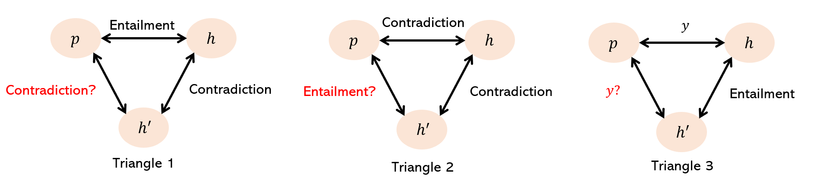
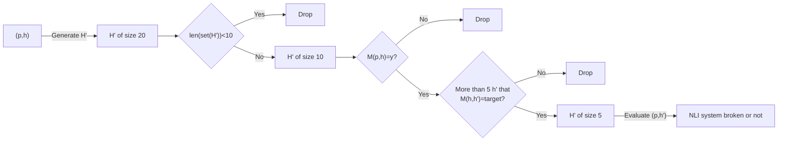

# BreakNLI
This project concerns the evaluation of NLI systems. The setting could be formulated as follows: 
1. Given an NLI dataset $D= \lbrace(x_1, y_1),...,(x_n, y_n) \rbrace$, where we have the premise-hypothesis pair $x_i=\lbrace p_i, h_i\rbrace$ and the label $y_i \in \lbrace Entailment, Contradiction, Neutral \rbrace$, and an NLI model $M$, where $M(p_i, h_i)=\hat{y}_i$ w.r.t. true label $y_i$.
2. Pick out pairs that $M(p, h)=\hat y=y$.
2. Using `Flan-T5-xl` (referred to $G$), generate 5 statements that contradicts the hypothesis, namely $G(h_i)=\lbrace h_i^1, ...,h_i^k,..., h_i^5 \rbrace$ and $M(h_i,h_i^k)=Contradiction$.
3. Evaluate whether the following 3 triangles hold or not by $M(p_i, h_i^k)$.




**Our hypothesis:**  
&ensp;&ensp; If the system is not able to change the label of an example accordingly, then the predictions are based on shallow patterns as opposed to a deep language understanding.

**NLI models:**
* google/flan-t5-base (tested)
* google/flan-t5-large (tested)
* google/flan-t5-xl (tested)
* google/flan-t5-xxl
* facebook/bart-large-mnli (tested)
* roberta-large-mnli (tested)
* valhalla/distilbart-mnli-12-1 (tested)
* microsoft/deberta-base-mnli (tested)
* microsoft/deberta-large-mnli (tested)
* microsoft/deberta-xlarge-mnli (tested)

**Problems to be looked into:**  
1. For pair $(p_i,h_i)$ whose $M(p_i, h_i)=Contradiction$ (Triangle 2), the generation of contradictive statements is hard for the current way. Because two sentences could contradict each other in many aspects, inducing legit inequality of the triangles. The following is a typical example where $M(p, h) = M(h, h^k)=M(p,h^k)=Contradiction$.
    > premise: The house is surprisingly small and simple, with one bedroom, a tiny kitchen, and a couple of social rooms.  
    > hypothesis: The house is very large and boasts over ten bedrooms, a huge kitchen, and a full sized olympic pool.  
    > generated hypothesis: The house is very small and boasts over ten bedrooms, a huge kitchen, and a full sized olympic pool.
    > 
2. Generation parameters of $G$ needs further consideration.
3. For the cases that $M(p, h^k)$ fails to comply with the relationship indicated by the triangles (1 & 3), does it really break the NLI system? We need to inspect the generated statements.
4. We are using the pairs that could be correctly perceived by the NLI system. Should be expect the system to make 100-percent in evaluation?

**Temporary results:**
<table class="tg">
<thead>
  <tr>
    <th class="tg-twlt">Dataset</th>
    <th class="tg-twlt" colspan="2">Inequality/relaxed inequality</th>
    <th class="tg-twlt">Flan-T5-base<br>(83.63%)</th>
    <th class="tg-twlt">Flan-T5-large<br>(88.93%)</th>
    <th class="tg-twlt">Flan-T5-xl<br>(90.91%)</th>
    <th class="tg-jn0g">bart-large-mnli<br>(90.10%)</th>
    <th class="tg-jn0g">roberta-large-mnli<br>(90.56%)</th>
    <th class="tg-jn0g">distilbart-mnli-12-1<br>(87.17%)</th>
    <th class="tg-jn0g">deberta-base-mnli<br>(88.77%)</th>
    <th class="tg-jn0g">deberta-large-mnli<br>(91.32%)</th>
    <th class="tg-jn0g">deberta-xlarge-mnli<br>(91.44%)</th>
  </tr>
</thead>
<tbody>
  <tr>
    <td class="tg-y3we" rowspan="7">MNLI</td>
    <td class="tg-y3we" rowspan="3">Contradictive<br>generation</td>
    <td class="tg-m2ts">Entailment</td>
    <td class="tg-y3we">18.27%/25.7%</td>
    <td class="tg-y3we">13.32%/24.15%</td>
    <td class="tg-y3we">10.21%/20.45%</td>
    <td class="tg-9wq8">11.37%/20.31%</td>
    <td class="tg-9wq8">9.94%/18.74%</td>
    <td class="tg-9wq8">11.73%/23.38%</td>
    <td class="tg-9wq8">11.23%/22.0%</td>
    <td class="tg-9wq8">7.58%/18.32%</td>
    <td class="tg-9wq8">9.34%/19.91%</td>
  </tr>
  <tr>
    <td class="tg-m2ts">Contradiction</td>
    <td class="tg-y3we">54.5%/78.23%</td>
    <td class="tg-y3we">47.88%/78.76%</td>
    <td class="tg-9wq8">52.14%/81.83%</td>
    <td class="tg-9wq8">51.91%/82.67%</td>
    <td class="tg-9wq8">48.59%/81.31%</td>
    <td class="tg-9wq8">56.38%/86.29%</td>
    <td class="tg-9wq8">49.7%/84.53%</td>
    <td class="tg-9wq8">47.66%/84.04%</td>
    <td class="tg-9wq8">45.7%/80.96%</td>
  </tr>
  <tr>
    <td class="tg-m2ts">Overall</td>
    <td class="tg-y3we">35.65%/50.9%</td>
    <td class="tg-y3we">30.05%/50.58%</td>
    <td class="tg-s55b">30.92%/50.77%</td>
    <td class="tg-9wq8">31.54%/51.33%</td>
    <td class="tg-9wq8">29.01%/49.61%</td>
    <td class="tg-9wq8">33.83%/54.52%</td>
    <td class="tg-9wq8">30.44%/53.23%</td>
    <td class="tg-9wq8">27.8%/51.46%</td>
    <td class="tg-9wq8">27.27%/50.02%</td>
  </tr>
  <tr>
    <td class="tg-y3we" rowspan="4">Entailed<br>generation</td>
    <td class="tg-m2ts">Entailment</td>
    <td class="tg-9wq8">4.71%/10.39%</td>
    <td class="tg-9wq8">2.61%/9.4%</td>
    <td class="tg-9wq8">3.21%/10.41%</td>
    <td class="tg-9wq8">2.21%/10.71%</td>
    <td class="tg-9wq8">2.23%/10.31%</td>
    <td class="tg-9wq8">2.95%/13.49%</td>
    <td class="tg-9wq8">2.54%/12.56%</td>
    <td class="tg-9wq8">1.52%/10.61%</td>
    <td class="tg-9wq8">1.79%/8.85%</td>
  </tr>
  <tr>
    <td class="tg-m2ts">Neutrality</td>
    <td class="tg-9wq8">18.83%/18.83%</td>
    <td class="tg-9wq8">16.52%/16.52%</td>
    <td class="tg-9wq8">14.64%/14.64%</td>
    <td class="tg-9wq8">14.77%/14.77%</td>
    <td class="tg-9wq8">14.23%/14.23%</td>
    <td class="tg-9wq8">17.95%/17.95%</td>
    <td class="tg-9wq8">14.03%/14.03%</td>
    <td class="tg-9wq8">13.32%/13.32%</td>
    <td class="tg-9wq8">13.41%/13.41%</td>
  </tr>
  <tr>
    <td class="tg-m2ts">Contradiction</td>
    <td class="tg-9wq8">5.95%/12.79%</td>
    <td class="tg-y3we">4.31%/10.89%</td>
    <td class="tg-y3we">3.17%/9.07%</td>
    <td class="tg-9wq8">3.77%/10.01%</td>
    <td class="tg-9wq8">3.67%/9.19%</td>
    <td class="tg-9wq8">4.97%/12.61%</td>
    <td class="tg-9wq8">4.3%/10.84%</td>
    <td class="tg-9wq8">3.65%/9.38%</td>
    <td class="tg-9wq8">4.03%/10.23%</td>
  </tr>
  <tr>
    <td class="tg-cwad">Overall</td>
    <td class="tg-nrix">9.18%/13.62%</td>
    <td class="tg-nrix">7.32%/12.02%</td>
    <td class="tg-nrix">6.64%/11.23%</td>
    <td class="tg-nrix">6.55%/11.71%</td>
    <td class="tg-nrix">6.36%/11.13%</td>
    <td class="tg-nrix">8.11%/14.53%</td>
    <td class="tg-nrix">6.73%/12.45%</td>
    <td class="tg-nrix">5.93%/11.05%</td>
    <td class="tg-nrix">6.11%/10.71%</td>
  </tr>
  <tr>
    <td class="tg-nrix" rowspan="7">SNLI</td>
    <td class="tg-nrix" rowspan="3">Contradictive<br>generation</td>
    <td class="tg-cwad">Entailment</td>
    <td class="tg-nrix">10.43%/15.69%</td>
    <td class="tg-nrix">8.34%/13.58%</td>
    <td class="tg-nrix">5.77%/9.48%</td>
    <td class="tg-nrix">6.4%/12.23%</td>
    <td class="tg-nrix">8.27%/14.94%</td>
    <td class="tg-nrix">8.73%/16.44%</td>
    <td class="tg-nrix">7.0%/12.54%</td>
    <td class="tg-nrix">4.53%/10.55%</td>
    <td class="tg-nrix">4.84%/10.39%</td>
  </tr>
  <tr>
    <td class="tg-cwad">Contradiction</td>
    <td class="tg-nrix">94.66%/97.88%</td>
    <td class="tg-nrix">91.79%/97.69%</td>
    <td class="tg-nrix">93.75%/97.85%</td>
    <td class="tg-nrix">93.93%/98.79%</td>
    <td class="tg-nrix">93.02%/98.66%</td>
    <td class="tg-nrix">94.78%/99.08%</td>
    <td class="tg-nrix">94.16%/99.24%</td>
    <td class="tg-nrix">93.63%/98.88%</td>
    <td class="tg-nrix">93.27%/98.81%</td>
  </tr>
  <tr>
    <td class="tg-cwad">Overall</td>
    <td class="tg-nrix">51.41%/55.68%</td>
    <td class="tg-nrix">49.12%/54.68%</td>
    <td class="tg-nrix">49.77%/53.68%</td>
    <td class="tg-nrix">49.65%/55.0%</td>
    <td class="tg-nrix">48.82%/54.99%</td>
    <td class="tg-nrix">50.78%/56.83%</td>
    <td class="tg-nrix">50.27%/55.58%</td>
    <td class="tg-nrix">48.9%/54.53%</td>
    <td class="tg-nrix">48.69%/54.24%</td>
  </tr>
  <tr>
    <td class="tg-nrix" rowspan="4">Entailed<br>generation</td>
    <td class="tg-cwad">Entailment</td>
    <td class="tg-nrix">6.46%/10.61%</td>
    <td class="tg-nrix">4.8%/9.07%</td>
    <td class="tg-nrix">7.52%/11.68%</td>
    <td class="tg-nrix">8.75%/15.63%</td>
    <td class="tg-nrix">6.01%/12.41%</td>
    <td class="tg-nrix">15.26%/22.96%</td>
    <td class="tg-nrix">7.23%/16.45%</td>
    <td class="tg-nrix">6.87%/12.71%</td>
    <td class="tg-nrix">8.98%/15.39%</td>
  </tr>
  <tr>
    <td class="tg-cwad">Neutrality</td>
    <td class="tg-nrix">23.26%/23.26%</td>
    <td class="tg-nrix">18.96%/18.96%</td>
    <td class="tg-nrix">20.44%/20.44%</td>
    <td class="tg-nrix">22.07%/22.07%</td>
    <td class="tg-nrix">20.57%/20.57%</td>
    <td class="tg-nrix">29.54%/29.54%</td>
    <td class="tg-nrix">23.02%/23.02%</td>
    <td class="tg-nrix">20.45%/20.45%</td>
    <td class="tg-nrix">21.15%/21.15%</td>
  </tr>
  <tr>
    <td class="tg-cwad">Contradiction</td>
    <td class="tg-nrix">4.79%/11.02%</td>
    <td class="tg-nrix">4.4%/10.71%</td>
    <td class="tg-nrix">3.5%/7.22%</td>
    <td class="tg-nrix">4.41%/10.5%</td>
    <td class="tg-nrix">4.7%/14.09%</td>
    <td class="tg-nrix">4.96%/12.79%</td>
    <td class="tg-nrix">4.98%/13.82%</td>
    <td class="tg-nrix">3.97%/10.36%</td>
    <td class="tg-nrix">3.65%/9.76%</td>
  </tr>
  <tr>
    <td class="tg-cwad">Overall</td>
    <td class="tg-nrix">11.37%/14.88%</td>
    <td class="tg-nrix">9.38%/12.93%</td>
    <td class="tg-nrix">10.27%/12.92%</td>
    <td class="tg-nrix">11.57%/15.93%</td>
    <td class="tg-nrix">10.41%/15.69%</td>
    <td class="tg-nrix">15.93%/21.39%</td>
    <td class="tg-nrix">11.67%/17.71%</td>
    <td class="tg-nrix">10.38%/14.47%</td>
    <td class="tg-nrix">11.03%/15.27%</td>
  </tr>
</tbody>
</table>

Inequal: At least 1 (among 5) $M(p, h^k)$ is given the opposite label of the label that it should have been predicted. For instance, given $M(p,h)=Contradiction$ and $M(h, h^k)=Entailment$, $M(p, h^k)=Entailment$.  
Strictly inequal: At least 1 (among 5) $M(p, h^k)$ does not comply with the relationship indicated by the corresponding triangle. For instance, given $M(p,h)=Contradiction$ and $M(h, h^k)=Entailment$, $M(p, h^k)=Entailment\mid Neutral$.  
Entailment: Results for premise-hypothesis pairs whose $M(p, h)=Entailment$.  

## Requirements
The environment should meet the following requirements:
  ```markdown
  datasets==2.2.2
  numpy==1.23.4
  openai==0.26.5
  scikit_learn==1.2.1
  torch==1.11.0+cu113
  transformers==4.10.3
  ```
  or install the required package by
  ```sh
  pip install -r requirements.txt
  ```
  
## Installation
Clone the repo 
  ```sh
  git clone https://github.com/ZhaoqLiu/BreakNLI.git
  ```

## Usage
### get_dataset.py
Run `get_dataset.py` to download the NLI dataset and save to the current directory. Use parameter `-n` to specify the dataset to be downloaded (defaults to `mnli`).
  ```sh
  python get_dataset.py -n anli
  ```
  
### gen_statements_flant5.py
Run `gen_contrad_flant5.py` to generate statements entailed and contradictive to hypotheses using Flan-T5 in dataset specified by parameter `-n` (defaults to `mnli`) with the size specified by `-s` (defaults to `10`). Use parameter `-gm` to select the generative model of Flan-T5 (defaults to `flan_t5_base`). Add parameter `-demo` to run generation demo.
  ```sh
  python gen_contrad_flant5.py -n mnli -s 10 -gm flan_t5_base
  ```

### evaluate_nli.py
Run `evaluate_nli.py` to evaluate the accuracy of NLI systems. There are several optional parameters that control the experiment: `-n` specifies the used dataset (defaults to `mnli`), `-nm` specifies the tested NLI model (defaults to `flan_t5_base`). For example:
  ```sh
  python evaluate_nli.py -n mnli -m flan_t5_base
  ```
The following is the result of different NLI system (variants of Flan-T5) using different prompts. The winning prompt is 
  ```markdown
  Read the following and determine if the hypothesis can be inferred from the premise: Premise: <premise> Hypothesis: <hypothesis>
  ```
|          | base   | large  | xl     |
|:--------:|:------:|:------:|:------:|
| prompt_1 | 0.7954 | 0.8527 | 0.8911 |
| prompt_2 | 0.8261 | 0.8751 | 0.8987 |
| prompt_3 | 0.8338 | 0.8884 | 0.9070 |

  
### evaluation.py
Run `evaluation.py` to run the experiment of breaking NLI system. Use `-nm` to select the model performing NLI. Use `-p` to choose to evaluate entailted generation or contradictive. Note that the dataset with generated statements should be prepared by running `gen_statements_flant5.py` before evaluation.
  ```sh
  python evaluation.py -nm flan_t5_base -p True
  ```

## Examples

### Example 1 - Contradiction could happen at different aspects of the sentence

Original primise: For example, the most recent edition of the Unified Agenda (April 2000) describes <ins>4,441 rulemaking actions</ins> under development or recently completed by 60 federal departments and agencies.

Original hypothesis: <ins>All the development</ins> happened with the individual federal departments and agencies.

Original label: 2

Selected contradictions: 

'All the development happened with the individual state departments and agencies.'

'There are no federal departments and agencies.'
 
'There was no development at all.'
 
'Federal departments and agencies are not involved in the development.'
 
'There are no federal departments and agencies that are involved in development.'
 
Generated labels: [2 2 2 2 2]

### Example 2 

Original primise: The alligator farm here is something of a curiosity.

Original hypothesis: The turtle farm is something of an oddity.

Original label: 2

Selected contradictions:

'The turtle farm is a common sight.'

'It is a normal farm.'

'No one has ever seen a turtle farm before'

'There are many turtle farms.' "It's a normal farm."

 'Nobody knows anything about the turtle farm.'
 
 "It's a normal place."
 
 'The turtle farm is a normal place.'
 
Generated labels: [2 2 2 2 2 2 2 2]

### Example 3 - Nonsense generated statements

Original primise: You were going to say?

Original hypothesis: You finished your previous sentence.

Original label: 2

Selected contradictions:

'There are no people in the room.'

"We can't do anything about it."

 'Nobody knows how to swim.'
 
Generated labels: [2 2 2]

### Example 4 - Nonsense daily conversation

Original primise: same and uh we'll.

Original hypothesis: I disagree.

Original label: 2

Selected contradictions:

'I am a believer.'

'I agree with you.'

'I am a believer in God.'

 "It's impossible to tell the difference between the two."
 
 "It's impossible for me to believe that." 'I agree with him.'
 
Generated labels: [1 0 1 1 2 1]

### Example 5 - Legit inequality

Original primise: These tentacled creatures may look terrible under water, but once out in the air they're revealed as small and not dangerous.

Original hypothesis: They look less threatening when they are out of the water.

Original label: 0

Selected contradictions:

'They look more threatening when they are in the water.'
 
 ...
 
'When they are in the water they look more dangerous.']
 
Generated labels: [0 ... 0]
